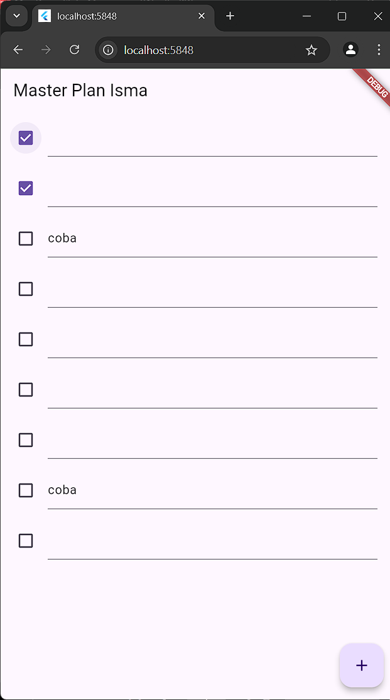

# Master_plan

### Nama : M.ismatullah.s.s
### Nim : 362358302099
#
### Praktikum 1 :
#
1. Selesaikan langkah-langkah praktikum tersebut, lalu dokumentasikan berupa GIF hasil akhir praktikum beserta penjelasannya di file README.md! Jika Anda menemukan ada yang error atau tidak berjalan dengan baik, silakan diperbaiki.
#
2. Jelaskan maksud dari langkah 4 pada praktikum tersebut! Mengapa dilakukan demikian?

- - A. Mempermudah Impor: Dengan adanya data_layer.dart, kita bisa mengimpor kedua model tersebut hanya dengan satu baris kode di file lain. Ini membuat kode lebih bersih dan mengurangi kemungkinan kesalahan atau kelupaan mengimpor salah satu model.

- - B. Sentralisasi: Ini menciptakan titik sentral untuk semua impor terkait data. Jika di masa depan ada perubahan atau penambahan model baru, kita hanya perlu memperbarui data_layer.dart dan tidak perlu mencari dan mengubah semua file yang mengimpor model-model tersebut.
#
3. Mengapa perlu variabel plan di langkah 6 pada praktikum tersebut? Mengapa dibuat konstanta?

- - diperlukan untuk menyimpan data terkait daftar tugas yang akan ditampilkan dan dikelola di dalam aplikasi. plan adalah sebuah instance dari kelas Plan yang menyimpan informasi tentang rencana dan daftar tugas yang terkait dengan rencana tersebut. Dengan adanya variabel plan, kita dapat mengelola state aplikasi dan memperbarui UI berdasarkan perubahan data di dalam variabel tersebut.
- - Dengan menjadikannya konstanta, kita memastikan bahwa nilai awal dari plan tidak akan berubah secara tidak sengaja setelah inisialisasi. membantu menjaga konsistensi data dan menghindari bug yang mungkin muncul karena perubahan data yang tidak sengaja.
#
4. Lakukan capture hasil dari Langkah 9 berupa GIF, kemudian jelaskan apa yang telah Anda buat!
#
5. Apa kegunaan method pada Langkah 11 dan 13 dalam lifecycle state?

- - A. Inisialisasi: Method initState() dipanggil sekali ketika objek State pertama kali dibuat. Ini digunakan untuk melakukan inisialisasi yang hanya perlu dilakukan sekali.

- - B. ScrollController: Diinisialisasi di sini untuk mengontrol perilaku scroll dari ListView. Listener ditambahkan untuk menghapus fokus dari semua TextField ketika event scroll terjadi.
#
- Kegunaan dispose():
- - A. Pembersihan: Method dispose() dipanggil ketika objek State dihapus secara permanen. Ini digunakan untuk membersihkan resource yang digunakan oleh State, seperti controller yang tidak lagi diperlukan.

- - B. ScrollController: Di-dispose di sini untuk melepaskan resource yang digunakan oleh ScrollController, mencegah kebocoran memori.
#

### Tugas 4 :
- Hasil :
  

    
  

#

### Praktikum 2 :
#
1. Selesaikan langkah-langkah praktikum tersebut, lalu dokumentasikan berupa GIF hasil akhir praktikum beserta penjelasannya di file README.md! Jika Anda menemukan ada yang error atau tidak berjalan dengan baik, silakan diperbaiki sesuai dengan tujuan aplikasi tersebut dibuat.
#
2. Jelaskan mana yang dimaksud InheritedWidget pada langkah 1 tersebut! Mengapa yang digunakan InheritedNotifier?

- - A. InheritedWidget itu semacam widget yang digunakan untuk menyimpan dan membagikan state ke widget-widget di bawahnya. Jadi, di langkah 1, PlanProvider itu contoh InheritedWidget yang berfungsi untuk membagikan state Plan ke widget-widget lain di bawahnya.

- - B. Sementara itu, InheritedNotifier adalah pengembangan dari InheritedWidget yang mendukung ValueNotifier, jadi pembaruan state bisa lebih efisien. Dengan InheritedNotifier,state cuma akan diperbarui kalau ValueNotifier-nya berubah, jadi gak perlu repot-repot merender ulang seluruh widget yang ada.
#
3. Jelaskan maksud dari method di langkah 3 pada praktikum tersebut! Mengapa dilakukan demikian?

- - A. completedCount: Menghitung jumlah tugas yang diselesaikan.

- - B. completenessMessage: Menghasilkan pesan yang menunjukkan berapa banyak tugas yang telah diselesaikan dari total tugas.
#
4. Lakukan capture hasil dari Langkah 9 berupa GIF, kemudian jelaskan apa yang telah Anda buat!
#
5. Kumpulkan laporan praktikum Anda berupa link commit atau repository GitHub ke spreadsheet yang telah disediakan!
#
  

    
  

#

  

    
  

# 

### Praktikum 3 :
#
1. Selesaikan langkah-langkah praktikum tersebut, lalu dokumentasikan berupa GIF hasil akhir praktikum beserta penjelasannya di file README.md! Jika Anda menemukan ada yang error atau tidak berjalan dengan baik, silakan diperbaiki sesuai dengan tujuan aplikasi tersebut dibuat.
#
2. Berdasarkan Praktikum 3 yang telah Anda lakukan, jelaskan maksud dari gambar diagram berikut ini!
  

    
  

#

3. Lakukan capture hasil dari Langkah 14 berupa GIF, kemudian jelaskan apa yang telah Anda buat!
#
4. Kumpulkan laporan praktikum Anda berupa link commit atau repository GitHub ke spreadsheet yang telah disediakan!
#
  

    
  

#

  

    
  

#